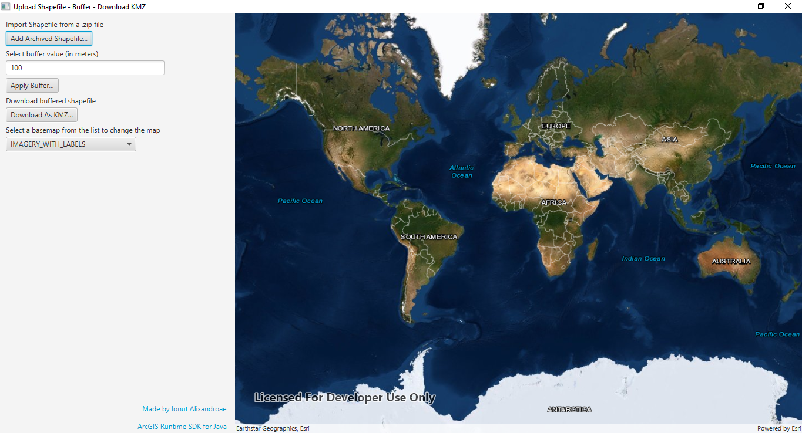

# Shapefile 2 Buffer KMZ App

Here is a simple project using the ArcGIS Runtime SDK for Java with Gradle to convert a zipped Shapefile to a buffered KMZ.

The project includes the Gradle wrapper, so there is no need to install Gradle to run the app.

The app launches a window displaying a map and a panel.

## How it works

1. Upload a zipped shapefile
2. The map will display the data and zoom to it
3. Change the basemap from the drop-down list of available basemaps
4. Apply a buffer to the uploaded Shapefile
5. Download the buffered data into a KMZ and save it locally

## Requirements

See the Runtime SDK's [system requirements](https://developers.arcgis.com/java/latest/guide/system-requirements-for-quartz.htm).

## Resources

* [ArcGIS Runtime SDK for Java](https://developers.arcgis.com/java/)   
